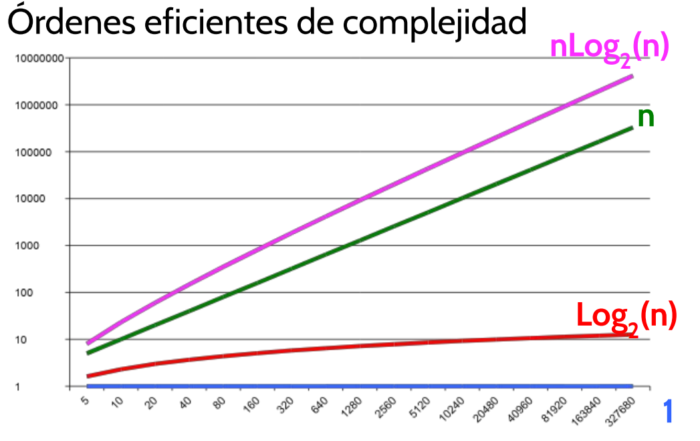
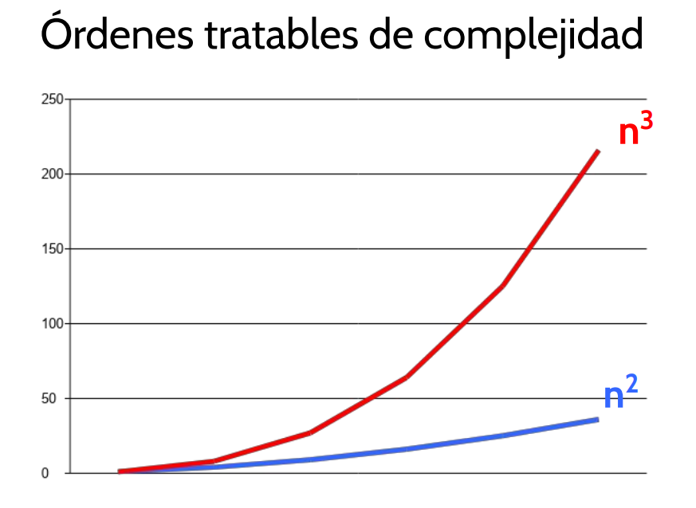
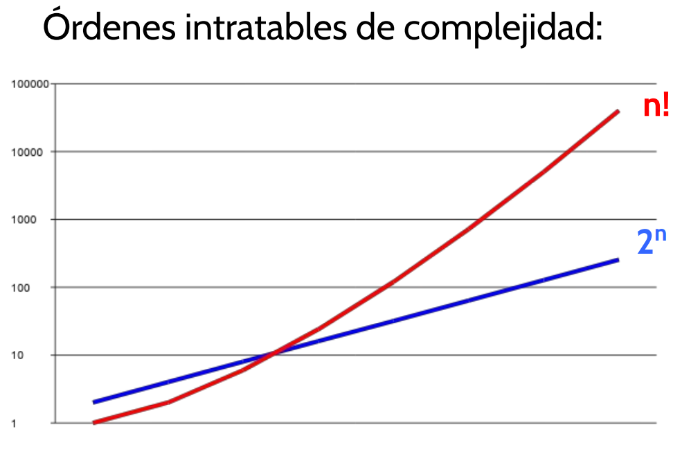

# Análisis de algoritmos

### Integrantes del grupo:
    -Francisco Gutierrez
    -Gaspar Inacio
### Comisión: 15

### Link youtube:

### Link github: https://github.com/GasparInacio/integrador_programacion

### El análisis de algoritmos es el estudio de la eficiencia de un algoritmo

### La eficiencia es la medida del coste de recursos que necesita el algoritmo para llevar a cabo su tarea

### Entre los recursos mas importantes se encuentran.
    - Tiempo de ejecución
    - Espacio de almacenamiento (memoria)

# Tipos de análisis

- Empírico
- Teórico

## Análisis empírico:
    - Se realiza la comparación de eficiencia de dos o mas algoritmos mediante gráficos que muestran los recursos (tiempo y memoria)
    - Deben implementarse los algoritmos, por tal motivo se consume tiempo de trabajo
    - Se debe utilizar el mismo entorno para ejecutar los diferentes algoritmos
    - Los resultados podrían no ser representativos para todas las posibles entradas

## Análisis teórico:
    - Se trata de un análisis que permite clasificar y comparar funciones temporales de algoritmos sin necesidad de implementar un entorno de prueba (software/hardware)
    - La función temporal T(n) representa el número de operaciones que deben ser ejecutadas para una entrada de tamaño n
    - Al ser una función, es posible considerar todas las entradas posibles

### El análisis teórico se basa en contabilizar las operaciones/instrucciones y asignarles una unidad de tiempo para luego llegar a un resultado final y poder comparar las funciones temporales entre si sin necesidad de implementarlas de manera práctica

### Dentro de las operaciones/instrucciones se pueden encontrar:
    - Operaciones primitivas
    - Bucles
    - Operaciones selectivas o condicionales

## Operaciones primitivas
    - Asignar valor a una variable -> x=2
    - Indexar un elemento en un array -> vector[3]
    - Devolver un valor en una función -> return x
    - Evaluar una expresión aritmética -> x+5
    - Evaluar una expresión lógica -> 0<i<index

#### En el casode que una operación/instrucción esté compuesta de varias operaciones primitivas, se debe secomponer y separar cada una para su evaluación

#### Ejemplo:

>return vector[3] + vector[6]

#### En este caso se puede descomponer de la siguiente manera:
    - 1 operación de acceso vector[3]
    - 1 operación de acceso vector[6]
    - 1 operación de suma
    - 1 operación return

#### La función temporal de las operaciones primitivas son constantes y no dependen del tamaño de la entrada

## Bucles
    - while condicion: operacion
    - for x in ... : operacion

#### La función temporal de los bucles se calcuña como el número de veces que se ejecuta el bucle por la función temporal de su bloque interno

#### Ejemplo:
>for i in range(1, n+1): # (n + 1)
>    result = result + i   # 2
#### En este caso, el número de iteraciones del bucle es n y la función temporal dentro del bloque es 2. Por lo tanto T(n) = n * 2

## Bucles anidados

#### Es el producto del número de iteraciones de cada bucle

#### Ejemplo:
>for i in range(n)
>    for i in range(n):
>        print(i*j)    # T(n) = 2

#### Por lo tanto el resultado del ejemplo anterior es T(n) = 2*n*n = 2(n**2)

## Condicionales
    - if/else

#### En este tipo de operaciones, solo un bloque se ejecutará mientras que los restantes solo se evaluarán de manera lógica

#### En este caso la función temporal se definirá como T(n) = max(Tb1(n), Tb2(n), Tbk(n))

#### Ejemplo:
>if opc == 1:                   # B1 
>    n = n + 1
>elif opc == 2:                 # B2
>    n = n + 2
>elif opc == 3:                 # B3
>    for i in range(1, n + 1):
>        print(i)
>else:                          # B4
>    print("Error")

#### El bloque con la mayor función temporal es B3, por lo tanto:
    - B1 = 1 (Evaluar la condición lógica)
    - B2 = 1 (Evaluar la condición lógica)
    - B3 = 1 (Evaluar la condición lógica) + n (Bucle del bloque interno)
#### T(n) = 3 + n

## Notación Big-O

#### Esta notación se utiliza para describir el comportamiento asintótico de las funciones permitiendo ver como crecen a medida que el tamaño de entrada crece (tendiendo a infinito). Se utiliza para poder simplificar la comparación de las funciones temporales eliminando constantes y términos de menor orden.

#### Pasos para simplificar funciones utilizando notación Big-O:
    - Identificar dentro de la función temporal el término de mayor crecimiento
    - Eliminar constantes y coeficientes

#### Ejemplo:
    - T(n) = 3(n**2) + 2n + 5 = O(n**2)
    - T(n) = 7n + 13 = O(n)
    - T(n) = 10 = O(1)

#### Órdenes de complejidad
| Notación   | Nombre          | Descripción                                           |
|------------|-----------------|-------------------------------------------------------|
| O(1)       | Constante       | El tiempo no depende de la entrada.                   |
| O(log n)   | Logarítmica     | Típico en algoritmos de búsqueda binaria.             |
| O(n)       | Lineal          | Tiempo proporcional al tamaño de la entrada.         |
| O(n log n) | Lineallogarítmica | Típico en algoritmos de ordenación eficientes.        |
| O(n²)      | Cuadrática      | Típico en bucles anidados.                            |
| O(2^n)     | Exponencial     | Típico en algoritmos de fuerza bruta.                 |
| O(n!)      | Factorial       | Típico en problemas de permutaciones.                 |

## Conclusiones

- El análisis de algoritmos permite comparar la complejidad temporal de un algoritmo y comparar algoritmos que resuelven el mismo problema para proponer la mejor solución. 
- El análisis empírico se basa en la medición de tiempos de ejecución de algoritmos para distintas entradas. La dificultad de este análisis radica en la necesidad de ejecutar el algoritmo y compararlo con los demás en las mismas condiciones, dependiendo del software y el hardware que se utilice. 
- El análisis teórico se ejecuta contabilizando el número de instrucciones del algoritmo para configurar una funcion temporal
- La obtención de la función temporal (T(n)) facilita el análisis ya que en base a las cotas superiores obtenidas (o funciones Big-O) permite comparar gráficamente las funciones temporales sin necesidad de implementar o requerir entornos de pruebas.

